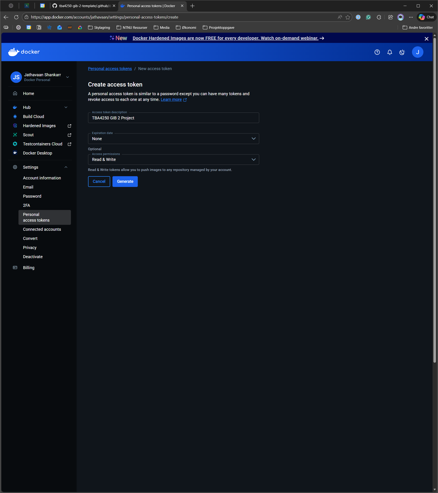
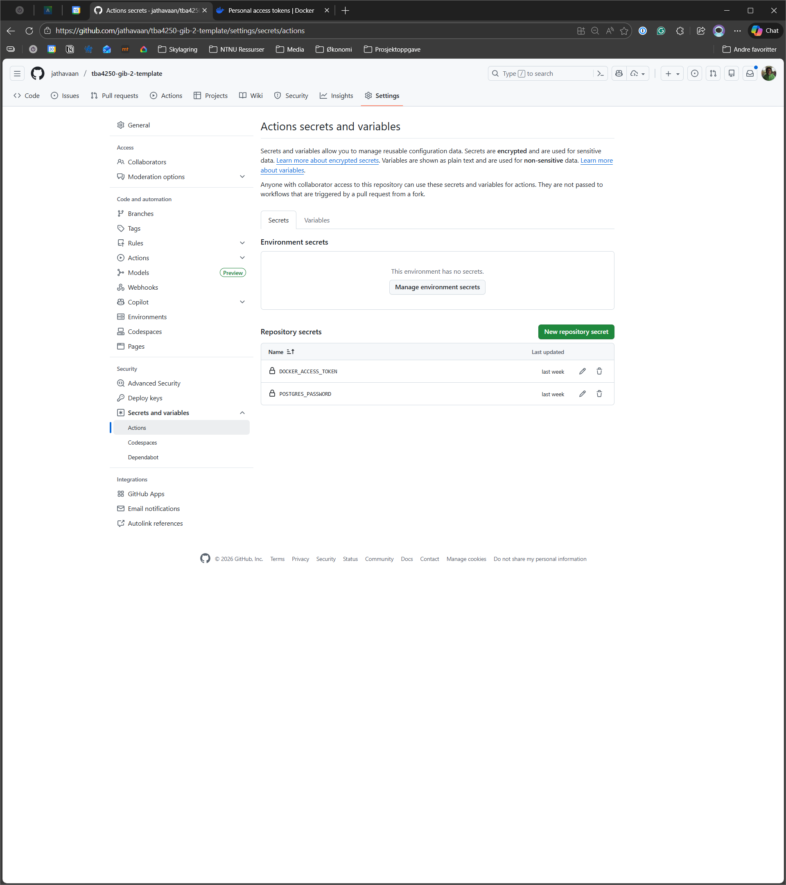
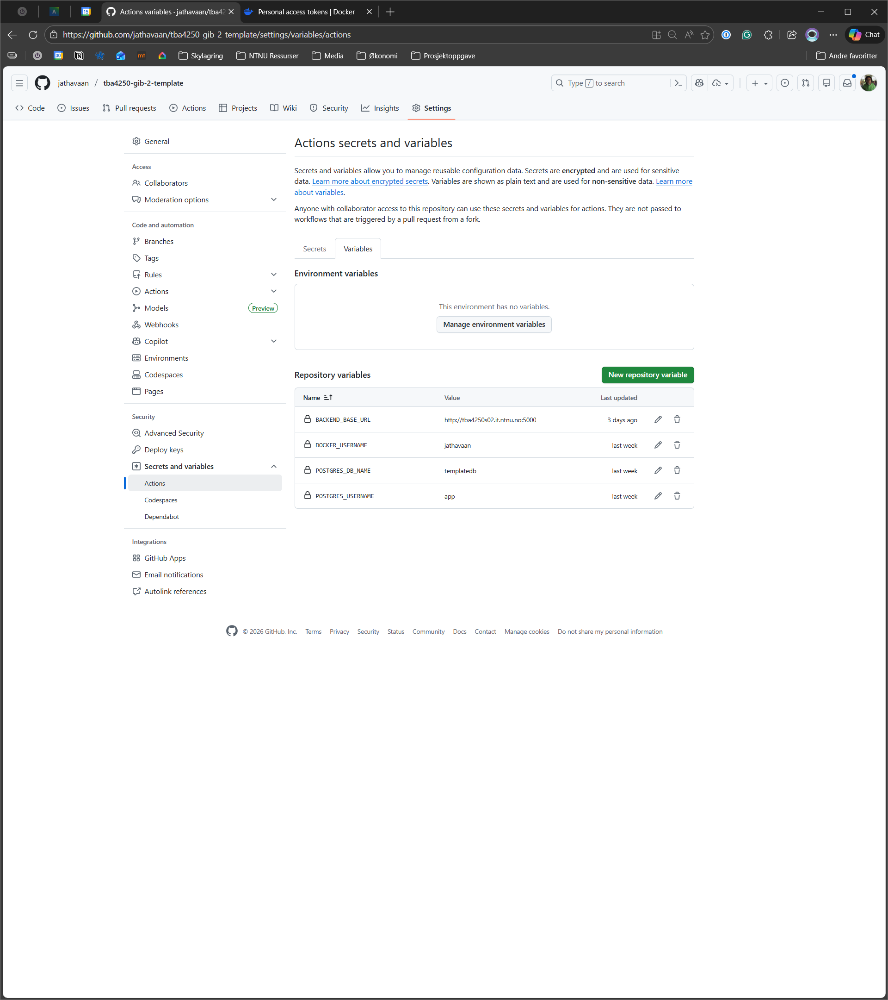

## Configure automated deploys

Automated deployments have been configured in the workflows defined in the [`.github/workflow`](../workflows) directory.
Some configuration is needed in each team's repository. This README contains instructions on how to configure the
deployment pipelines. Feel free to change the pipelines to match your needs

### Create Docker Hub Account and Personal Access Token

The deployment pipelines build and publish Docker images to a **public** Docker repository. An account
on [Docker Hub](https://hub.docker.com/) is therefore needed. Only one team member needs to do this and the images will
be deployed to their Docker repositories.

The next step is to create a Personal Access Token (PAT). Sign in to [Docker](https://docker.com), and under *Settings*
select *Personal access token*. Press *Generate new token* and give it a descriptive name such as *TBA4250 GIB 2
Project*. Under *Access permissions* select `Read & Write` and then press *Generate*. The access token can only be
viewed once, so save it somewhere secure. An access token is like a password, and should be treated as such. Do not
publish it as plain text to GitHub or any other place it can be abused.

    

### GitHub Actions variables and secrets

> [!NOTE]
> Ensure that all secrets and variables are spelled correctly.

The workflows run **on** GitHub and variables and secrets have to be defined on GitHub for it to work. Whilst in the
repository press *Settings* in the repository menubar. Under the section *Security* select *Secrets and variables* and
click on the *Actions* tab.

    

Under the *Secrets* tab create two new **repository secrets**: `DOCKER_ACCESS_TOKEN` and `POSTGRES_PASSWORD`. The
`DOCKER_ACCESS_TOKEN` is the personal access token defined in the previous step, and the `POSTGRES_PASSWORD` is the
database password for the database hosted on a server (not the same as the one running locally). Under the `Variables`
tab create four variables:

- `BACKEND_BASE_URL` as http://tba4250s02x.it.ntnu.no:5000 where `x` is the group number
- `DOCKER_USERNAME` username of the owner of the Docker PAT
- `POSTGRES_DB_NAME` a database name
- `POSTGRES_USERNAME` database username

Refer to the image below for an example on how to do this.

    

### Test the action and configure Docker repositories

> [!CAUTION]
> All secrets are packed into the images, and this does not follow best practices. Other measures have to be taken to
> ensure that the project is production ready, but this setup is sufficient for this course and project

> [!NOTE]
> Set the repository visibility to public

In the repository menubar select *Actions* and run the workflows named
`Build and publish client image to docker registry` and `Build and publish server image to docker registry`. The images
should be published to Docker Hub if everything worked. Two repositories should have been created:
`tba4250-gib-2-client` and `tba4250-gib-2-server`. Ensure that these are set to public. Other team members can be added
as collaborators on Docker Hub.